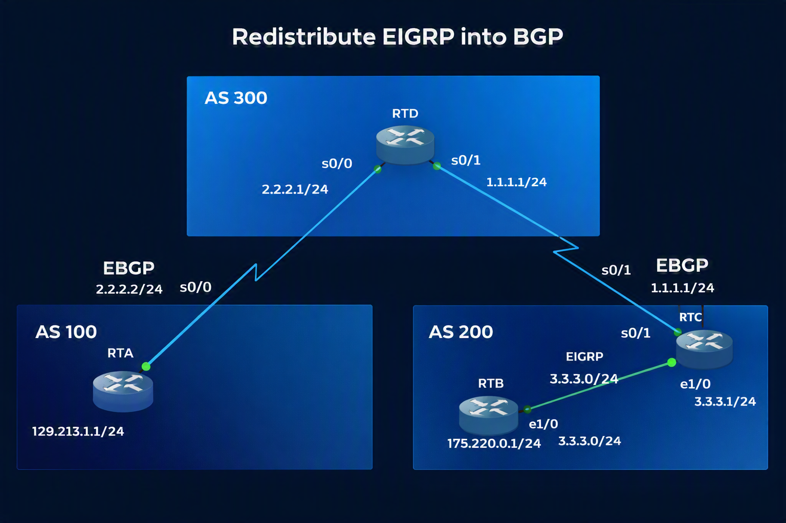

# Case Study 02: BGP to EIGRP Redistribution

## Introduction
This document details the configuration process for redistributing BGP routes into an Interior Gateway Protocol (IGP), specifically EIGRP. The ability to exchange routing information between BGP and IGP protocols is crucial for managing traffic flow in complex, multi-protocol network environments.

### TOPOLOGY: BGP to IGP Redistribution



### Main Objective: BGP to IGP Redistribution Summary
The primary goal is to successfully redistribute a BGP-learned route (`129.213.1.0/24`) into an EIGRP domain, ensuring reachability across different autonomous systems and protocols. Learning how to configure the redistribution of routes learned via BGP into an Interior Gateway Protocol (IGP).

#### Case Study Details
To achieve this objective, the lab guides the student through the following technical steps:

* **Network to be inserted**: The focus is on the `129.213.1.0/24` network using the following command:
  
* **Origin**: This network is originally published in **AS 100** (via Router RTA) using the `network` command within the BGP configuration.
* **Destination (Redistribution)**: The final goal is to redistribute this specific route (`129.213.1.0/24`), which is learned via BGP, into an EIGRP domain (configured in **AS 200** via Router RTC).

In summary, this lab demonstrates how to make a network that exists in the BGP environment known and accessible within an internal infrastructure using EIGRP.

## Technical Context
The BGP `network` command is used to advertise specific routes from an IGP into BGP. Conversely, redistribution allows an IGP to learn routes that originated in BGP, facilitating end-to-end connectivity.
it will be achieve using the following configuracion on RTA Configuration
 ```text
  !
router bgp 100
 network 129.213.1.0 mask 255.255.255.0
  ```


## Implementation Steps

### 1. BGP Configuration
The routers are configured to establish BGP neighbor relationships across different autonomous systems.

**RTA Configuration:**

```text
! 
router bgp 100
 no synchronization
 bgp log-neighbor-changes
 network 129.213.1.0 mask 255.255.255.0
 neighbor 2.2.2.1 remote-as 300
 no auto-summary
!
```
**RTD Configuration:**
```text
! 
router bgp 300
 no synchronization
 bgp log-neighbor-changes
 neighbor 1.1.1.2 remote-as 200
 neighbor 2.2.2.2 remote-as 100
 no auto-summary
!
```
**RTC Configuration:**
```text
! 
router bgp 200
 no synchronization
 bgp log-neighbor-changes
 neighbor 1.1.1.1 remote-as 300
 no auto-summary
!
```

EIGRP Configuration
EIGRP is enabled on internal routers (RTB and RTC) to facilitate internal routing and redistribution.

**RTB Configuration:**
```text
! 
router eigrp 100
 network 3.3.3.0 0.0.0.255
 network 175.220.0.0 0.0.0.255
```
**RTC Configuration:**
```text
! 
router eigrp 100
 redistribute bgp 200
 network 3.3.3.0 0.0.0.255
 default-metric 1000 100 250 100 1500
 auto-summary
```
## 2. Analysis of Routing Table Entry

The routing table entry in Router B (RTB) appears as follows:

```text
D EX 129.213.1.0 [170/2611200] via 3.3.3.1, 00:34:06, Ethernet0/0
```
D EX: Indicates that the route was learned via EIGRP External (redistributed into EIGRP).

170: The Administrative Distance (AD) for EIGRP External routes.

2611200: The composite metric calculated by EIGRP.
