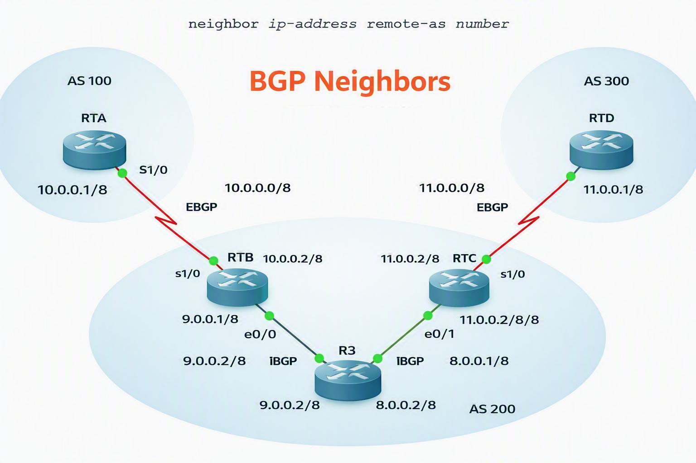
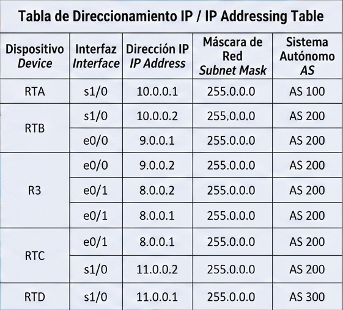
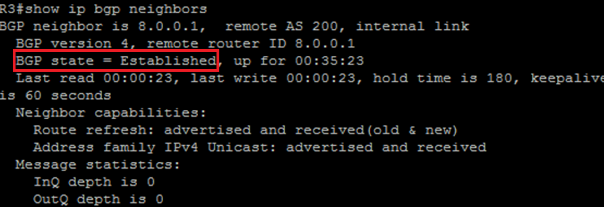

## BGP Neighbors

### Introduction
Two BGP routers become neighbors once a TCP connection has been established between them. This TCP connection is essential for the routers to initiate the exchange of routing updates. 

Once the TCP connection is established, the routers send `OPEN` messages to exchange information. The values exchanged between routers include the Autonomous System (AS) number, the BGP version currently running, the BGP Router ID, and Keepalive timers. 

After these values are confirmed and accepted, the neighbor relationship is established. Any state other than "Established" indicates that the routers have failed to become neighbors, preventing the exchange of BGP updates.

### Objective
In this laboratory, we will learn how to configure BGP neighbor relationships using the following command:

```text
neighbor <ip-address> remote-as <as-number>
```
                      
## 🗺️ Topology Diagram


## 🗺️ IP Addressing Table


## ACTIVITY


1. Configure all link connections according to the IP Addressing Table.
2. Verify that the interfaces between the devices have connectivity.
3. Load the BGP configuration on routers RTA, RTB, and RTC. Router RTD will be configured in the next step.

Router A (RTA) CONFIG:
   
```text
!
router bgp 100
 no synchronization
 bgp log-neighbor-changes
 neighbor 10.0.0.2 remote-as 200
 no auto-summary
!
```
Router B (RTB) CONFIG:
  ```text
!
router bgp 200
 no synchronization
 bgp log-neighbor-changes
 neighbor 9.0.0.2 remote-as 200
 neighbor 10.0.0.1 remote-as 100
 no auto-summary
!
```
Router 3 (R3) CONFIG:
   
```text
!
 router bgp 200
 no synchronization
 bgp log-neighbor-changes
 neighbor 8.0.0.1 remote-as 200
 neighbor 9.0.0.1 remote-as 200
 no auto-summary
!
```
Router C (RTC) CONFIG:

```text
!
router bgp 200
 no synchronization
 bgp log-neighbor-changes
 neighbor 8.0.0.2 remote-as 200
 neighbor 11.0.0.1 remote-as 300
 no auto-summary
!
```

4. View the BGP neighbors using the `SHOW IP BGP NEIGHBORS` command on **ROUTER 3**. Verify that the BGP state equals **Established**.

## 🗺️ ROUTER 3 `SHOW IP BGP NEIGHBORS` BGP state equals **Established**.

