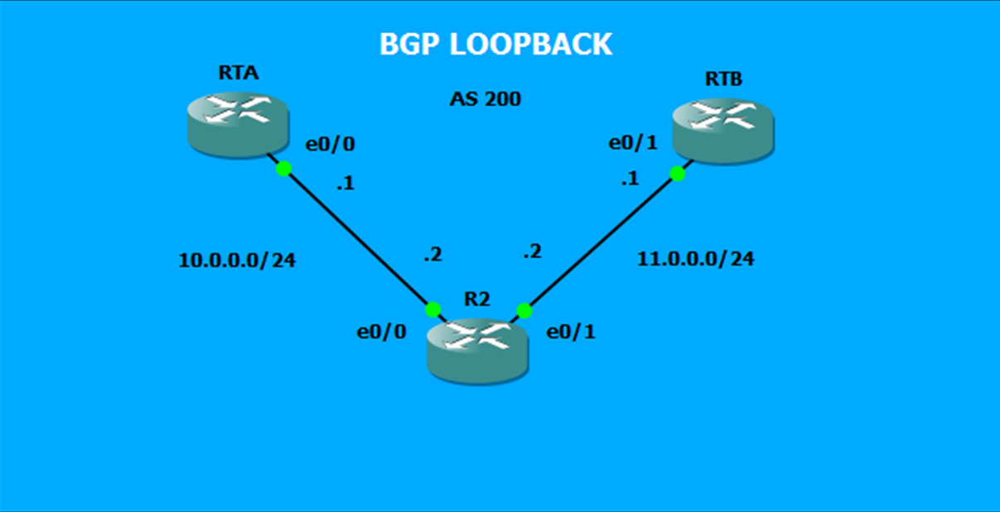

# Case Study 03: BGP Peering over Loopback Interfaces

## Introduction
This document details the configuration process for establishing BGP neighbor relationships using loopback interfaces instead of physical interfaces. By default, BGP uses physical interface IP addresses to form TCP connections. Leveraging loopback interfaces ensures session stability and independence from physical hardware link status, which is an essential design pattern in large-scale network architecture.

### TOPOLOGY: BGP Loopback Peering



### Main Objective: BGP Loopback Peering Summary
The primary goal is to successfully configure BGP peering using loopback interfaces across an Autonomous System (AS 200). This lab demonstrates how to overcome default BGP source-IP behaviors by implementing the `update-source` command to stabilize neighbor establishment.

#### Case Study Details
To achieve this objective, the lab guides the student through the following technical steps:

* **Loopback Addressing**: Utilizing virtual loopback interfaces to anchor the BGP router ID and peer IP addresses.
* **OSPF Integration**: Enabling an Interior Gateway Protocol (IGP), specifically OSPF, to provide reachability to the loopback IP addresses across the topology.
* **Source Modification**: Forcing BGP to use the loopback address as the source for TCP and BGP connection packets using `update-source`.

In summary, this lab demonstrates how to build a fault-tolerant BGP peering architecture independent of physical link fluctuations.

## Technical Context
By design, when a BGP neighbor is configured with a specific IP address, the local router originates the TCP connection (port 179) using the primary IP address of the outgoing physical interface.

If the remote peer expects the BGP session to originate from a loopback address, a mismatch occurs, leaving the session stuck in the **Active** state. The `neighbor [ip-address] update-source [interface]` command overrides this behavior, instructing the BGP process to source packets from the specified loopback interface. Additionally, a session reset (`clear ip bgp *`) is required to re-establish the connection using the new parameters.

## Implementation Steps

### 1. BGP Base Configuration
The routers are configured within AS 200 to establish neighbor relationships pointing to loopback addresses.

**RTA Configuration:**
 
 ```text
!
router bgp 200
 no synchronization
 bgp log-neighbor-changes
 neighbor 3.3.3.3 remote-as 200
 no auto-summary
!
 ```
**RTB Configuration:**

 ```text
!
router bgp 200
 no synchronization
 bgp log-neighbor-changes
 neighbor 3.3.3.3 remote-as 200
 no auto-summary
!
 ```
**R2 (Router 2) Configuration:**
 ```text
!
router bgp 200
 no synchronization
 bgp log-neighbor-changes
 neighbor 1.1.1.1 remote-as 200
 neighbor 2.2.2.2 remote-as 200
 no auto-summary
!
 ```
### 2. Enable OSPF on all routers in the topology.

COMMAND DESCRIPTION:

### 2.1 `router ospf 1`

**Enables the OSPF routing process:** This command starts the OSPF engine on the router and enters the configuration mode for that protocol.

**The number 1 (Process ID):** It is the local process identifier. Unlike other protocols, this number only has local significance on the router (it does not need to match neighboring routers to communicate, although keeping it consistent is a good practice for organization). The same router can run multiple independent OSPF processes if necessary.

### 2.2 `router-id 1.1.1.1`

**Defines the Router ID:** OSPF requires a unique 32-bit IP address to unambiguously identify each router within an area or autonomous system.

**Stability and Election:** If you do not configure this command manually, the router will automatically choose its Router ID based on the highest IP address of its active Loopback interfaces, or, failing that, the highest IP address of its active physical interfaces. Defining it manually with an IP (in this case 1.1.1.1) prevents the Router ID from changing if a physical interface goes down, which could otherwise cause unnecessary network topology resets (OSPF re-convergence).

**RTA OSPF Configuration:**

 ```text
!
router ospf 1
router-id 1.1.1.1
network 10.0.0.0 0.0.0.255 area 0
network 1.1.1.1 0.0.0.0 area 0
!
 ```
**RTB OSPF Configuration:**

 ```text
!
router ospf 1
router-id 2.2.2.2
network 11.0.0.0 0.0.0.255 area 0
network 2.2.2.2 0.0.0.0 area 0
!
 ```
**RT2 OSPF Configuration:**

 ```text
!
router ospf 1
router-id 3.3.3.3
network 10.0.0.0 0.0.0.255 area 0
network 11.0.0.0 0.0.0.255 area 0
network 3.3.3.3 0.0.0.0 area 0
!
 ```


### 2. Loopback Source Updates
To resolve the connection mismatch, the update source must be explicitly declared on all participating routers.

Router 2 (R2) Configuration:

 ```text
!
router bgp 200
neighbor 1.1.1.1 update-source Loopback0
neighbor 2.2.2.2 update-source Loopback0
!
```

RTA Configuration:

 ```text
!
router bgp 200
neighbor 3.3.3.3 update-source loopback 0
!
```

RTB Configuration:

 ```text
!
router bgp 200
neighbor 3.3.3.3 update-source l0
!
```

### 3. Analysis of Troubleshooting and Verification

* **The "Active" State Mismatch**: When configuring BGP to peer with loopback addresses without `update-source`, pings to the loopback succeed (via OSPF), but BGP remains stuck in the **Active** state. This happens because the source IP of the TCP SYN packet matches a physical interface instead of the expected loopback identity, causing the remote peer to drop or ignore the connection request.
* **Verification via CLI**: After applying the `update-source` command and clearing the session (`clear ip bgp *`), verify the establishment using Router 2:


* **State/PfxRcd (`0`)**: A numeric value indicates that the session has successfully transitioned from `Active`/`Connect` to the **Established** state.
* **Up/Down Time**: Displays the active duration of the stable peering session.


