# Case Study 04: Route Aggregation in BGP

One of the major improvements of BGP4 over BGP3 is **Classless Inter-Domain Routing (CIDR)**. CIDR, or supernetting, is a new way of looking at IP addresses. With CIDR, the concept of classes, such as Class A, B, or C, does not exist. 

For example, the network `192.213.0.0/16`, which was once an illegal Class C network, is now a legal supernet: `192.213.0.0/16`. The "16" represents the number of bits in the subnet mask, counted from the extreme left of the IP address. This representation is similar to `192.213.0.0 255.255.0.0`.

You can use aggregates in order to minimize the size of routing tables. Aggregation is the process that combines the characteristics of different routes in such a way that advertising a single route is possible. In this practice, RTB generates the `160.10.0.0` network; therefore, we are going to configure RTC to propagate a supernet of that route to `160.0.0.0` RTA:

### TOPOLOGY:  Route Aggregation in BGP.

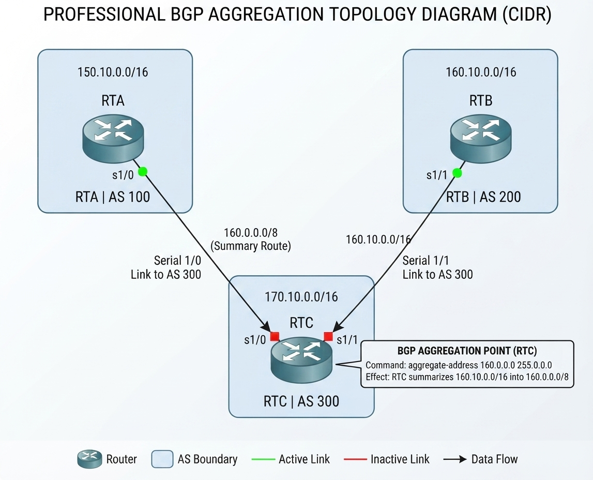

# Case Study 04: Route Aggregation in BGP IMPORTANT NOTE:

For BGP to advertise a network using the `network` command, that network (or a more specific subnet covering it, depending on the aggregation configuration and IOS version behavior) must already exist in the router's main routing table (RIB), learned through any protocol (connected, static, OSPF, EIGRP, etc.).

This requirement is sometimes referred to as the "origin condition" in Cisco.

### What happens if the route is not in the routing table?

If you configure the `network 170.10.0.0 mask 255.255.0.0` command, but the router does not have any route to `170.10.0.0/16` in its IP table:

* The command will be accepted and saved in the configuration (`running-config`).
* But BGP will ignore it: It will not install it in its BGP table and, therefore, will not advertise it to your peers.
* If you check with the `show ip bgp` command, you will not see that network (or it will appear without the `>` best path symbol).

As soon as you create that route on the router (for example, with a static route pointing to `Null0` to ensure it always exists: `ip route 170.10.0.0 255.255.0.0 Null0`), BGP will automatically detect it, put it into its table, and advertise it without you having to run any `clear ip bgp`.

## 2. Case Study: Physical Connectivity & Initial BGP Setup

1. Configure all physical connections between the router links.
2. Verify that interfaces between devices have end-to-end IP connectivity.
3. Configure the routers to establish EBGP neighbor relationships using the parameters below:

### Router A (RTA)
```text
!
router bgp 100
 no synchronization
 bgp log-neighbor-changes
 neighbor 2.2.2.1 remote-as 300
 no auto-summary
!
```

### Router C (RTC)
```text
!
router bgp 300
 no synchronization
 bgp log-neighbor-changes
 neighbor 2.2.2.2 remote-as 100
 neighbor 3.3.3.1 remote-as 200
 no auto-summary
!
```
### Router B (RTB)
```text
!
router bgp 200
 no synchronization
 bgp log-neighbor-changes
 neighbor 3.3.3.1 remote-as 300
 no auto-summary
!
```
Run the show ip bgp summary command on each router.

### Router A (RTA)

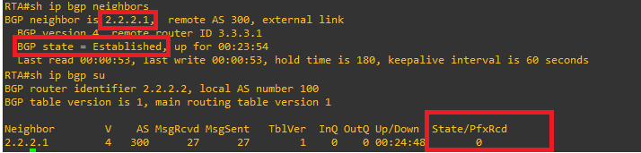


### Router C (RTC)

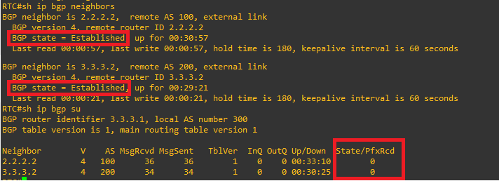

### Router B (RTB)

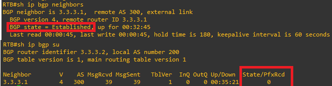

## 2. Advertising Individual Routes
2.1. Configure Router A (RTA)

Configure the network to be advertised by RTA:

```text
!
interface Ethernet0/0
 ip address 150.10.0.1 255.255.0.0
 half-duplex
!
!
router bgp 100
 network 150.10.0.0 mask 255.255.0.0
!
```

Verification: Inspect the routing tables on Router A, Router B, and Router C

### Router A (RTA)

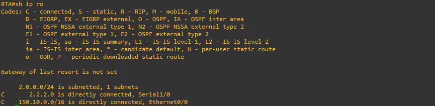


### Router C (RTC)

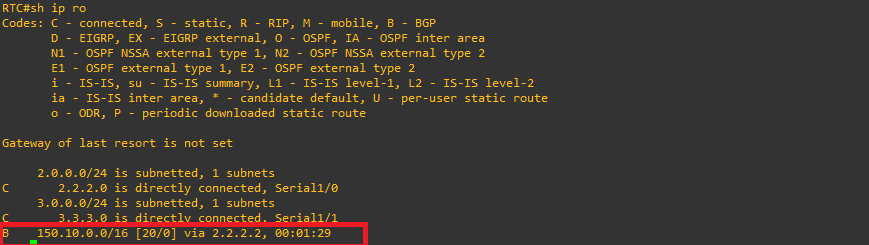

### Router B (RTB)

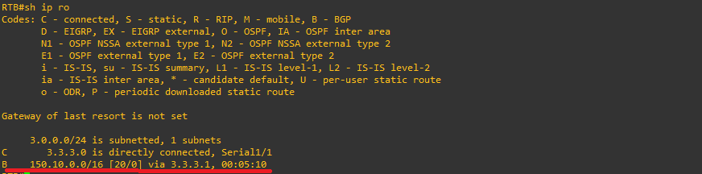

2.2 Configure Router C (RTC)
Configure the network to be advertised by RTC:

```text
!
interface Ethernet0/0
 ip address 170.10.0.1 255.255.0.0
 half-duplex
!
!
router bgp 300
 network 170.10.0.0 mask 255.255.0.0
!
```


Verification: Inspect the routing tables on Router A, Router B, and Router C

### Router A (RTA)

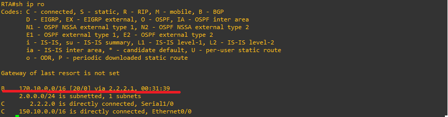


### Router C (RTC)

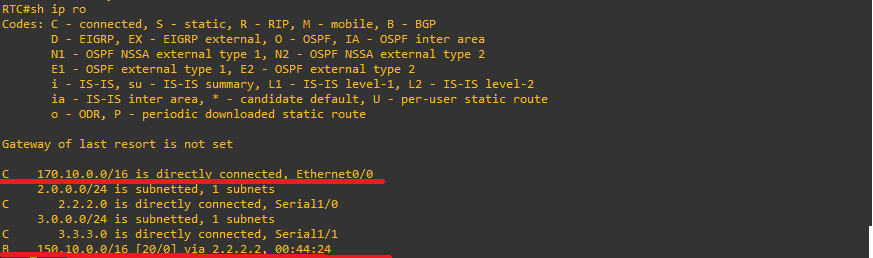

### Router B (RTB)

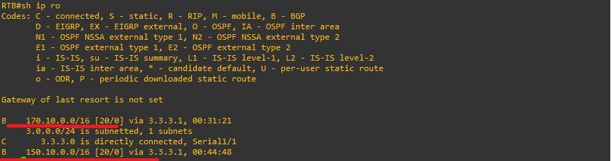

2.3 Configure Router B (RTB)
Configure the network to be advertised by RTC:

```text
!
interface Ethernet0/0
 ip address 160.10.0.1 255.255.0.0
 half-duplex
!
router bgp 200
 network 160.10.0.0 mask 255.255.0.0
```


Verification: Inspect the routing tables on Router A, Router B, and Router C

### Router A (RTA)

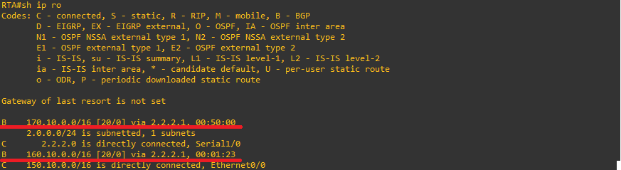


### Router C (RTC)

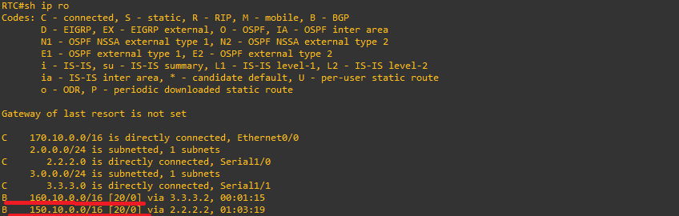

### Router B (RTB)

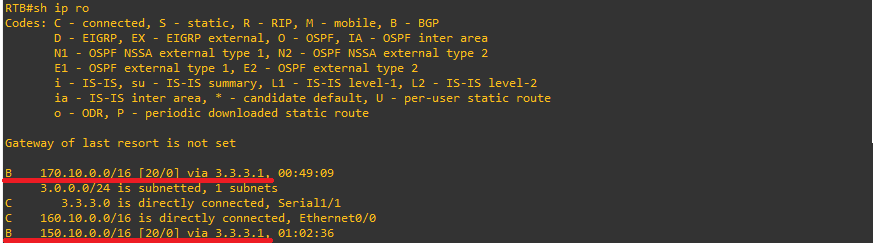

### 4. Applying Route Aggregation

To apply route aggregation on Router C, use the following syntax:

`aggregate-address address-mask`

#### Configuration on Router C (RTC)

Update Router C configuration to include the aggregated supernet:

```text
!
router bgp 300 
 neighbor 3.3.3.3 remote-as 200 
 neighbor 2.2.2.2 remote-as 100 
 network 170.10.0.0 
 aggregate-address 160.0.0.0 255.0.0.0
 !
```
