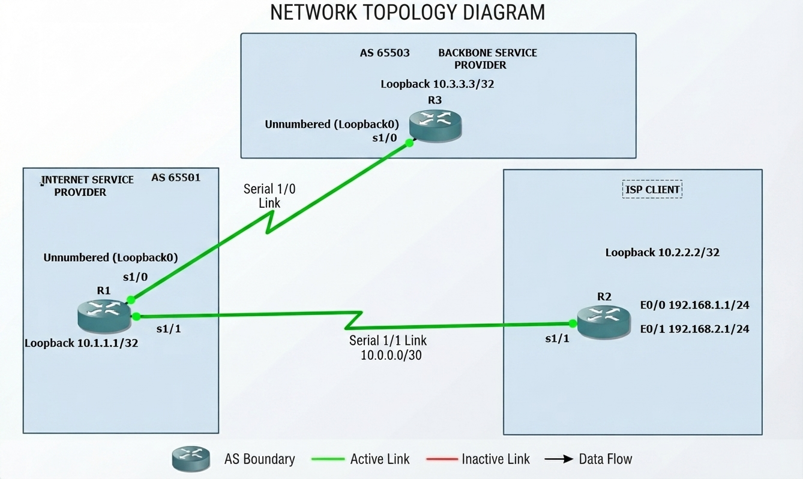
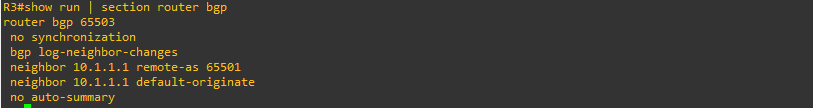
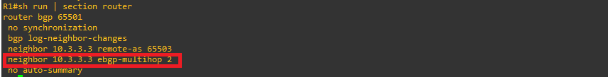
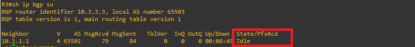
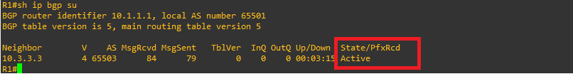
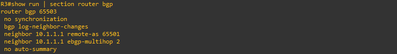
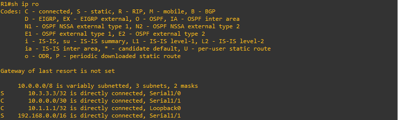
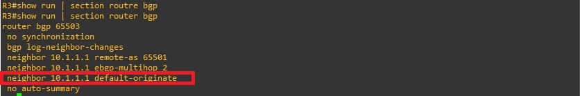
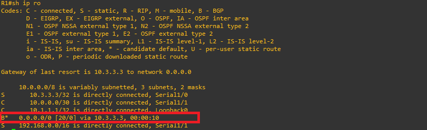

# Default Routes Between ASs in BGP

## Introduction

A local Internet Service Provider (ISP-R1, represented by CANTV) provides one of its clients with a network block of `192.168.0.0/16`. In this practice, the client divides the `192.168.0.0/16` network into `/24` masks and only uses the `192.168.1.0/24` and `192.168.2.0/24` networks.

The ISP router (R1) configures a static route for `192.168.0.0/16` pointing toward the client's router (R2). The ISP CANTV connects to an ISP backbone represented by router BB-R3. Router R3 sends a default route to ISP-R1 (CANTV) and receives the `192.168.0.0/16` network via BGP from ISP-R1.

Accessibility is now guaranteed through the Internet (ISP Backbone router R3) to the client router (R2) because R2 has a default route configured to point to ISP-R1 (CANTV). However, if packets are destined for network blocks not in use outside the `192.168.0.0/16` range, the client router R2 uses the default route to ISP-R1, which forwards the packets.

### TOPOLOGY:  Route Aggregation in BGP.



```text
neighbor {ip-address | peer-group-name} default-originate [route-map map-name]
no neighbor {ip-address | peer-group-name} default-originate [route-map map-name]
```
## Technical Context

In network scenarios where a service provider (ISP) or an edge router advertises a summary block (for example, `192.168.0.0/16`) toward a customer or internal router (`cust-R2`), if traffic is destined for an IP address within that block that is not active or configured on the receiving router's specific interfaces, the router will use its default route to forward the packet back to the network core. This generates a continuous routing loop between the routers until the packet's TTL (Time to Live) field expires, severely affecting CPU utilization and link performance.

* **Value-Add:**
  * Clear identification of the impact on network resources (CPU consumption and link saturation due to TTL expiration).
  * Direct solution using the routing command to `Null0`.
  * Advanced solution for dynamic or intermittent link scenarios (such as ISDN) through the use of floating static routes with a high administrative distance.
* **Iterative Refinement:**
  * **Loop Detection:** Identify traffic bouncing between `ISP-R1` and `cust-R2` using tracing/debugging (`debug ip packet`) when attempting to reach an unassigned IP (e.g., `192.168.20.1`).
  * **Application of Primary Static Route to Null0:**

 ```text
!
ip route 192.168.1.0 255.255.255.0 Null0 200
!
```

## Interactive Discovery

* **Analyzed Topology:**
  * **BB-R3:** Backbone router (upstream ISP) connected via eBGP to `ISP-R1`.
  * **ISP-R1:** Local provider router that originates/injects the summary block `192.168.0.0/16` toward the customer and has a static route toward the customer router (`cust-R2`).
  * **`cust-R2`:** Customer router that handles specific subnets (`192.168.1.0/24`, `192.168.2.0/24`) and has a default route pointing to `ISP-R1`.
* **Root Problem:** Lack of a discard route for unused addresses within the summarized range, causing traffic destined for unused or malicious IPs (DoS attacks, scans) to bounce indefinitely.

COMMAND REFERENCE:

In the context of the technical document and BGP (Border Gateway Protocol) routing protocols, these commands serve specific functions to establish eBGP neighborship between routers that are not directly connected and to propagate default routing information:

* **`neighbor 10.1.1.1 ebgp-multihop 2`** (or the configured value):
  * By default, eBGP (External BGP) sessions require neighboring routers to be directly connected (their TTL value for BGP packets is 1). Since in many topologies eBGP routers communicate through virtual interfaces (such as Loopbacks) or are separated by more than one network hop, this command allows you to **increase the allowed TTL hop limit** for BGP packets. This ensures that the eBGP session can come up correctly between the routers (for example, between `BB-R3` and `ISP-R1`) using Loopback addresses.
 
* **`neighbor 10.1.1.1 default-originate`**:
  * This command configures a router (in this case, typically a provider or backbone router like `BB-R3`) to **originate and advertise a default route (`0.0.0.0/0`)** toward its BGP neighbor (`ISP-R1`). This allows the receiving router to learn a default route to forward all external traffic toward the Internet or the network core without needing to learn all the routes from the backbone.

## IMPORTANT NOTE ABOUT (`neighbor ip-address ebgp-multihop value`) COMMAND (`neighbor 10.1.1.1 ebgp-multihop 2`):

Router 3 (R3) without the neighbor 10.1.1.1 ebgp-multihop 2 command but Router 1 (R1) with it`s neighbor 10.3.3.3 ebgp-multihop 2 command configure:

R3:



R1: 



Router 3 neighbor state output without the neighbor 10.1.1.1 ebgp-multihop 2 command configured in R3:



On R3 (Idle): You are completely right about the TTL. Since R3 is trying to establish an eBGP session with an IP that is not on a directly connected network (for example, a Loopback interface), BGP defaults to sending those packets with a TTL of 1. Even though R3 has the IP route to reach R1, the IPv4 packet is dropped at the first hop because the TTL reaches 0 (or R3 drops the eBGP security validation for not being directly connected neighbors). Because of this, R3 cannot progress and remains in Idle.

Router 1 neighbor state output without the neighbor 10.1.1.1 ebgp-multihop 2 command configured in R3:



On R1 (Active): Here the technical nuance is that R1 is indeed the one trying to initiate the TCP connection toward R3 by sending a SYN packet. However, the response packets or synchronization fail because the returning packets (or the eBGP neighbor validation) are affected by the lack of multihop on R3, or R3 rejects/ignores the attempt. Since the TCP three-way handshake cannot be completed (no bidirectional connection is established), R1 gets stuck retrying repeatedly, which is precisely reflected in the Active state (waiting for/initiating a TCP connection without receiving the response that finalizes the establishment).

## IMPORTANT NOTE ABOUT (`default-originate`) COMMAND (`neighbor 10.1.1.1 default-originate`):

In a network architecture, although the local ISP (`ISP-R1`) could manually create a static default route toward the backbone, using `default-originate` from the upstream provider's edge router (`BB-R3`) responds to a strategy of dynamism, scalability, and ISP operations for the following reasons:

* **Dynamism and Automatic Advertisement:**
  BGP is designed to dynamically advertise which networks are reachable. If the backbone (`BB-R3`) decides to change its internet gateway or restructure its egress, the default route is automatically updated via BGP. If it were a manual static route on `ISP-R1`, any change in the backbone topology would require manual intervention on the customer or local provider routers.
* **Centralized Upstream Provider Control:**
  The transit provider (upstream ISP on `BB-R3`) is the entity that actually provides internet access. It is an engineering best practice for the provider to "advertise" or "offer" the default route to its BGP clients (`ISP-R1`). Thus, the local ISP does not have to guess or manually configure where to send unknown traffic; it simply trusts what its upstream provider injects via BGP.
* **Flexibility in Routing Policies:**
  By using BGP to originate the default route, `BB-R3` can conditionally control whether or not to deliver internet connectivity to `ISP-R1` based on policies, service-level agreements (SLAs), payment status, or route filters, without needing to modify static configurations on the customer or local provider equipment.

Router 3 (R3) without the neighbor 10.1.1.1 default-originate command:



Router 1 routing table output without the neighbor 10.1.1.1 default-originate command configured in R3:



Router 3 (R3) with the neighbor 10.1.1.1 default-originate command:



Router 1 routing table output with the neighbor 10.1.1.1 default-originate command configured in R3:



# Practical Exercise

## Step 1: Configure Connections
* Configure all physical and logical connections between the links as illustrated in the network topology.
  
### Router 3 (R3)
```text
!
interface Loopback0
 ip address 10.3.3.3 255.255.255.255
!
interface Serial1/0
 ip unnumbered Loopback0
 serial restart-delay 0
!
ip route 10.1.1.1 255.255.255.255 Serial1/0
!
```
### Router 1 (R1)
```text
!
!
interface Loopback0
 ip address 10.1.1.1 255.255.255.255
!
interface Serial1/0
 ip unnumbered Loopback0
 serial restart-delay 0
!
interface Serial1/1
 ip address 10.0.0.1 255.255.255.252
 serial restart-delay 0
!
ip route 10.3.3.3 255.255.255.255 Serial1/0
ip route 192.168.0.0 255.255.0.0 Serial1/1
!
```
### Router 2 (R2)
```text
!
interface Loopback0
 ip address 10.2.2.2 255.255.255.0
!
interface Ethernet0/0
 ip address 192.168.1.1 255.255.255.0
 half-duplex
!
interface Ethernet0/1
 ip address 192.168.2.1 255.255.255.0
 half-duplex
!
interface Serial1/1
 ip address 10.0.0.2 255.255.255.252
 serial restart-delay 0
!
ip route 0.0.0.0 0.0.0.0 10.0.0.1
!
```

## Step 2: Verify Connectivity
* Verify that the interfaces between all devices have proper physical and logical connectivity.

## Step 3: Configure BGP and Routing
* Configure Router 1 (R1) to establish an EBGP relationship with Router 3 (R3) and Router 2 (R2), while advertising the necessary networks.

### Router 3 (R3)
```text
!
router bgp 65503
 no synchronization
 bgp log-neighbor-changes
 neighbor 10.1.1.1 remote-as 65501
 neighbor 10.1.1.1 ebgp-multihop 2
 neighbor 10.1.1.1 default-originate
 no auto-summary
!
```
### Router 1 (R1)
```text
!
router bgp 65501
 no synchronization
 bgp log-neighbor-changes
 neighbor 10.3.3.3 remote-as 65503
 neighbor 10.3.3.3 ebgp-multihop 2
 network 192.168.0.0 mask 255.255.0.0
 no auto-summary
!
