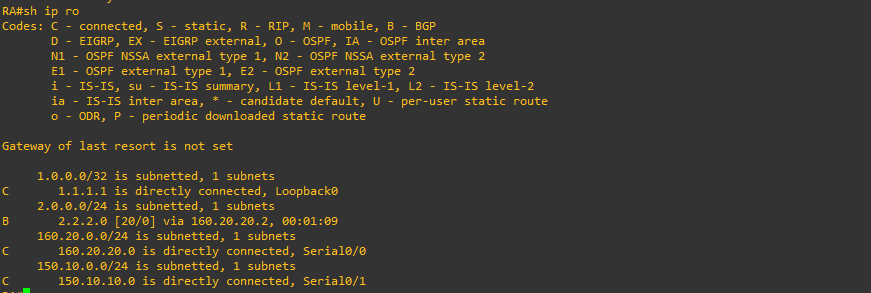
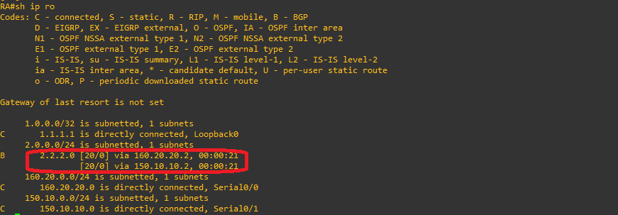
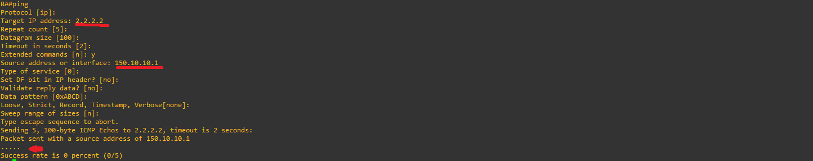
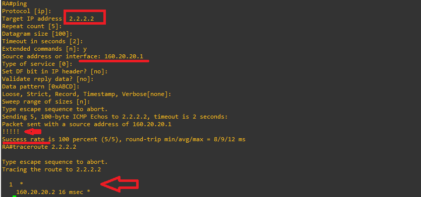
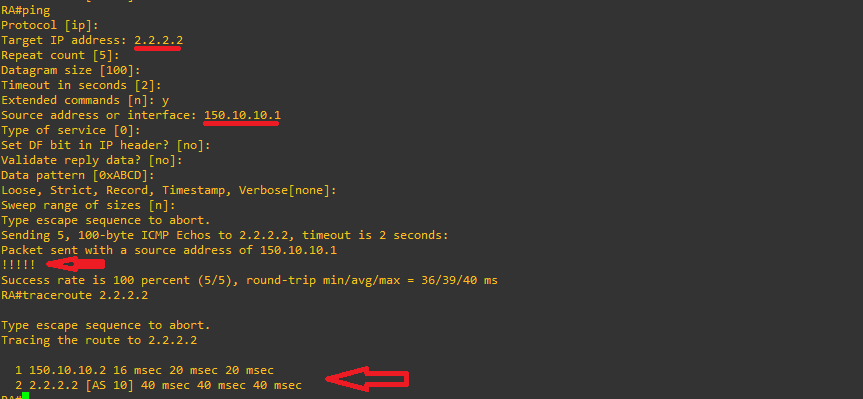

## Introduction & Key Concepts

By default, BGP selects only a single best path to reach a destination network and does not perform load balancing. When multiple paths exist between a local AS and a remote AS, BGP chooses just one based on its path selection algorithm.+

To achieve load sharing with equal-cost paths, you can use the BGP configuration command:

 ```text
maximum-paths [1-6]
 ```
This command allows you to change the maximum number of parallel equal-cost paths allowed in the routing table (accepting values from 1 to 6).

⚙️ Step 1: EBGP Neighbor Configuration
Configure BGP on Router A (AS 11) to establish eBGP peering relationships with Routers B and C in AS 10.

Router A (RA - AS 11)

 ```text
!
router bgp 11
 no synchronization
 bgp log-neighbor-changes
 neighbor 150.10.10.2 remote-as 10
 neighbor 160.20.20.2 remote-as 10
 no auto-summary
!
 ```
Router B (RB - AS 10)

 ```text
!
router bgp 10
 no synchronization
 bgp log-neighbor-changes
 neighbor 160.20.20.1 remote-as 11
 no auto-summary
!
 ```
Router C (RC - AS 10)

```text
!
router bgp 10
 no synchronization
 bgp log-neighbor-changes
 neighbor 150.10.10.1 remote-as 11
 no auto-summary
!
 ```
Analysis Questions:
1.1) Use the `show ip bgp summary` command to verify adjacencies.
1.2) Has the BGP neighbor relationship been established? Why? (Verify physical connectivity, IP addressing, and neighbor policies).

Step 2: Network Advertisement
Each router advertises its respective networks into BGP.

```text
! ROUTER A
router bgp 11
 network 1.1.1.1 mask 255.255.255.255
!
```

```text
! ROUTER B
router bgp 10
 network 2.2.2.0 mask 255.255.255.0
!
```

```text
! ROUTER C
router bgp 10
 network 2.2.2.0 mask 255.255.255.0
```

2.1) Routing Table on Router A (RA sh ip ro)



**🚀 Step 3: Implementing the maximum-paths Command

### 3.1 & 3.2) Command Configuration and Verification
To allow BGP to install multiple equal-cost paths, add `maximum-paths 2` inside the BGP configuration process on Router A:

```text
!
router bgp 11
 no synchronization
 bgp log-neighbor-changes
 network 1.1.1.1 mask 255.255.255.255
 neighbor 150.10.10.2 remote-as 10
 neighbor 160.20.20.2 remote-as 10
 maximum-paths 2
 no auto-summary
!
```



Now, network `2.2.2.0` clearly shows two active entries across both next-hops (`160.20.20.2` and `150.10.10.2`).

* **Router A:** Advertises its Loopback interface (1.1.1.1/32).
* **Router B and C:** Advertise the shared destination network (2.2.2.0/24).


### Steps 4 & 5: Connectivity Verification

Perform extended pings from Router A to IP `2.2.2.2` specifying the source outgoing interface.

* **Test 1:** Exiting through interface Serial0/1 (`150.10.10.1`) NO SUCCESSFULL

**



* **Test 2:** Exiting through interface Serial0/1 (`160.20.20.1`) SUCCESSFULL



In the proposed scenario, one ping responds successfully while the other fails due to a classic problem of asymmetric routing and a lack of return routing in the remote AS (AS 10).  
Here is a detailed explanation of what happens:

* **Forward path:** When you configure the `maximum-paths 2` command on Router A (RA), it knows it can send traffic toward the `2.2.2.0/24` network using both the `160.20.20.2` (Serial0/0) and `150.10.10.2` (Serial0/1) next-hops. Therefore, data packets physically leave your router through both interfaces.  
* **The issue with the Serial0/0 interface (`160.20.20.1`):** When performing the extended ping by forcing traffic out of this interface, the packets reach Router B (RB) in the remote AS. However, if the remote router does not have a properly configured return route (or an adequate BGP advertisement) specifically directed toward that interface's source subnet (`160.20.20.0/24`), the reply packets from the destination (`2.2.2.2`) will not know how to return through that link or will be dropped.  
* **Success through Serial0/1 (`150.10.10.1`):** In contrast, through the Serial0/1 interface, the reverse path is fully operational, propagated, and accepted in the routing tables of AS 10, allowing round-trip traffic to flow without packet loss (100% success rate).

  ### Steps 6 & 7: Troubleshooting & Final Verification

#### 6.1) Problem Analysis
**Why does the ping succeed through one interface and fail through the other when reaching IP `2.2.2.2`?**

This typically happens due to asymmetric routing or missing return routes on the remote AS (AS 10) for that specific source IP subnet, or because of filtering / missing interface advertisements in the reverse direction.

In summary, this is not a failure of your local link or of BGP on Router A, but rather an issue with how the remote AS manages return traffic for each of the connected point-to-point subnets.

#### 7.1) Load Balancing Verification via Traceroute

In order to resolve the issue commented in steps Steps 4 & 5, let`s configure eigrp routing protocol in routers RB and RC:

RB configuration:

```text
!
router eigrp 1
 network 2.2.2.0 0.0.0.255
 network 160.20.20.0 0.0.0.255
 no auto-summary
!
```

RC configuration:

```text
!
router eigrp 1
 network 2.2.2.0 0.0.0.255
 network 150.10.10.0 0.0.0.255
 no auto-summary
!
```

Once the return path routing issue is resolved in the remote ISP/AS, running multiple `traceroute` commands toward destination `2.2.2.2` will demonstrate load balancing by alternating next-hop exits:




### Advertisement Configuration
