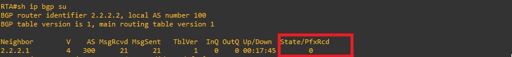
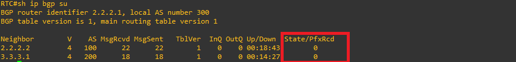
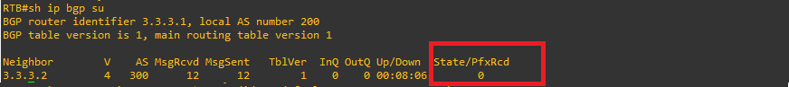
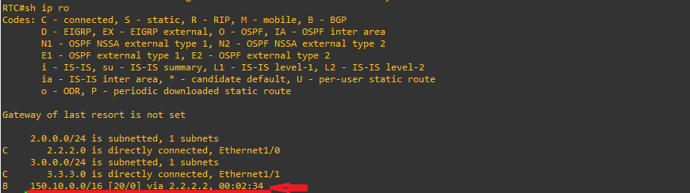
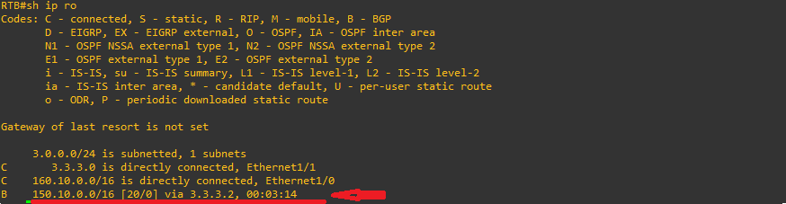

## Implementing BGP Communities for Route Control and Filtering

**Objective of this Practice:** Configure RTB (AS 200) to set the community attribute on BGP routes it advertises so that RTC (AS 300) does not propagate those routes to external peers like RTA (AS 100), using the `no-export` well-known community filter.

## Introduction & Key Concepts

This series of commands configures the Border Gateway Protocol (BGP) routing protocol on a router (typically Cisco IOS). Its main function is to advertise a local network to a BGP neighbor by applying a special tag called a Community to control how external autonomous systems will propagate that route.

Below is a step-by-step breakdown of what each block does:

## STEP BY STEP CONFIGURATION

### 1. BGP Configuration (`router bgp 200`)

```text
router bgp 200 
 network 160.10.0.0 mask 255.255.0.0
 neighbor 3.3.3.2 remote-as 300 
 neighbor 3.3.3.2 send-community 
 neighbor 3.3.3.2 route-map setcommunity out
```

Analysis Questions:

Use the show ip bgp summary command on each router to inspect neighbor states.

Has the BGP neighbor relationship been established successfully? Verify physical links, IP connectivity, and AS configurations.

⚙️ Step 1: Initial EBGP Neighbor Configuration
Configure the BGP routing processes on RTA, RTB, and RTC to establish peering sessions.

**Router A (RTA - AS 100)**


 ```text
!
router bgp 100
 no synchronization
 bgp log-neighbor-changes
 neighbor 2.2.2.1 remote-as 300
 no auto-summary
!
 ```
Router C (RTC - AS 300)

```text
!
router bgp 300
 no synchronization
 bgp log-neighbor-changes
 neighbor 2.2.2.2 remote-as 100
 neighbor 3.3.3.1 remote-as 200
 no auto-summary
!
```
Router B (RTB - AS 200)

```text
!
router bgp 200
 no synchronization
 bgp log-neighbor-changes
 neighbor 3.3.3.2 remote-as 300
 no auto-summary
!
```
Verification: Inspect the routing tables on RTA, RTB, and RTC to verify the propagation of network 150.10.0.0/16.

**Router A (RTA - AS 100) verification**



**Router C (RTA - AS 300) verification**



**Router B (RTB - AS 200) verification**




📡 Step 2: Advertising Networks from RTA

**RTA Configuration**

**Router A (RTA - AS 100)**

 ```text
!
router bgp 100
 network 150.10.0.0 mask 255.255.0.0
!
 ```
Verifiying network 150.10.0.0 255.255.0.0 on RTC & RTA:

**Router C (RTC - AS 300) verification**



**Router B (RTB - AS 200) verification**




📡 Step 3: Advertising Networks from RTC
RTC Configuration

**Router C (RTC - AS 300)**

 ```text
!
router bgp 300
 network 170.10.0.0 mask 255.255.0.0 
!
 ```
📡 Step 4: Advertising Networks from RTB

**RTB Configuration**

Verification: Check the routing tables across all routers to confirm visibility of network 170.10.0.0.

 ```text
!
router bgp 200
 network 160.10.0.0 mask 255.255.0.0
!
 ```
Verification: Verify routing tables on RTA, RTB, and RTC. At this stage, all networks are fully visible across the topology.

🛠️ Step 5: Applying Community Filters & ACLs on RTB
To prevent RTB's routes from being exported further by RTC to external peers (like RTA), configure a route map with the `no-export` community and tie it to an access list.

**Configuration on RTB**

Router B (RTB - AS 200)

```text
!
router bgp 200 
 network 160.10.0.0 mask 255.255.0.0
 neighbor 3.3.3.2 remote-as 300 
 neighbor 3.3.3.2 send-community 
 neighbor 3.3.3.2 route-map setcommunity out 
!
route-map setcommunity permit 10
 match ip address 1 
 set community no-export  
!
access-list 1 permit 0.0.0.0 255.255.255.255
!
```
### Key Commands Explained:

* `neighbor 3.3.3.2 send-community`: Mandatory command to pass community attributes to neighbor RTC.
* `set community no-export`: Ensures the receiving router (RTC) will not advertise these updates to external AS peers (RTA).
* `access-list 1 permit 0.0.0.0 255.255.255.255`: Matches routes according to the defined filter rule.

  ### 🔍 Step 6: Verification and Analysis on RTA

#### 6.1) Analysis Questions

* **What effect does permitting network `0.0.0.0/24` (or `0.0.0.0 255.255.255.255` wildcard matching) via the access list have?**  
  It acts as a wildcard match to select routes advertised in the updates processed by the route map.

* **Why does network `160.10.0.0` no longer appear in the routing table of Router A (RTA)?**  
  Because RTB tagged the update with the `no-export` community when sending it to RTC. Respecting this community attribute, RTC kept the route in its local/transit routing table but refused to advertise or export it to external neighbors in other Autonomous Systems (such as RTA in AS 100).

* **What is the purpose of the command `set community community-number [additive] [well-known-community]`?**  
  It allows tagging BGP route updates with custom or standard community values (like `no-export`, `no-advertise`, or `local-AS`) to enforce centralized routing policies across multiple administrative domains.


