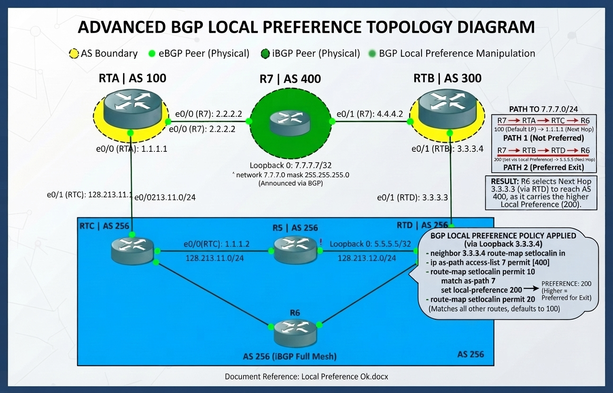
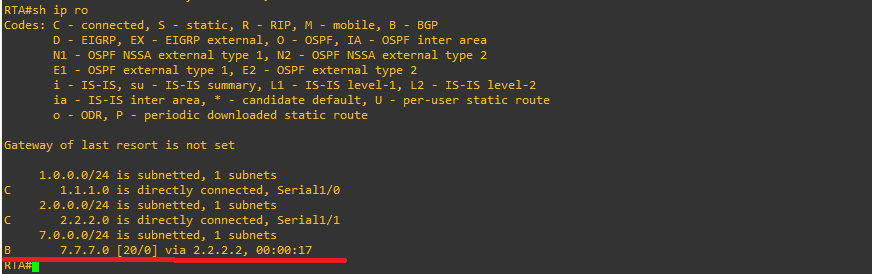
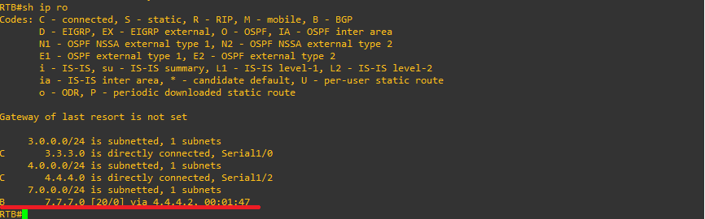
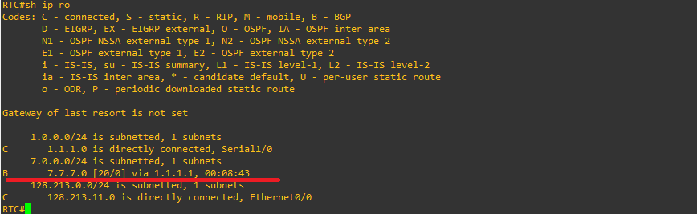
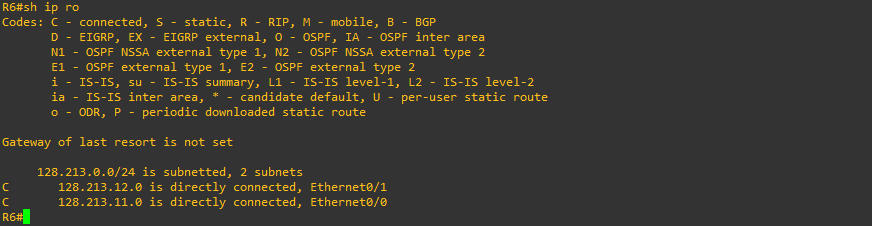
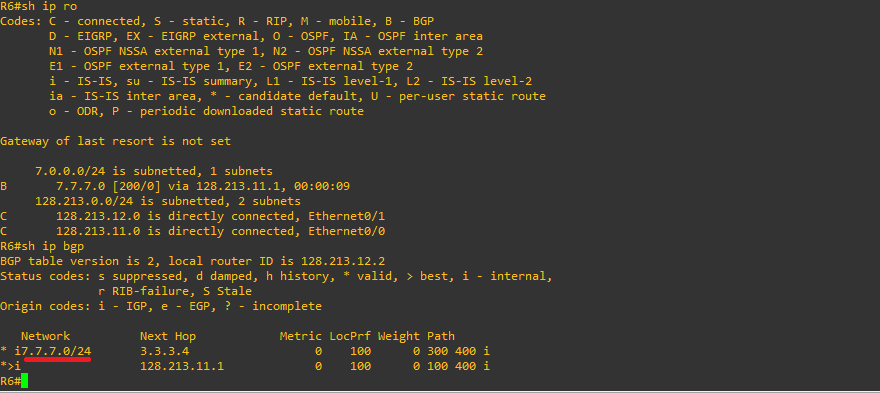
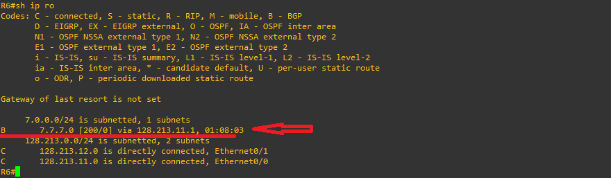

# Case Study 09: LOCAL PREFERENCE ATTRIBUTE

The Local Preference attribute is used to influence the preferred exit point from an Autonomous System. Local preference is propagated throughout the entire local Autonomous System. If there are multiple exit points from the AS, this attribute is used to select the exit path for a specific route. A route with a higher Local Preference value is chosen, and the default value is 100. The command to use is as follows:



## PRACTICE

1. Configure all connections between the links.
2. Verify that the interfaces between the devices have connectivity.
3. Configure all routers to have connectivity among all their BGP neighbors.

**Router A (RTA - AS 100):**
 
 ```text
!
router bgp 100
 no synchronization
 bgp log-neighbor-changes
 neighbor 1.1.1.2 remote-as 256
 neighbor 2.2.2.2 remote-as 400
 no auto-summary
!
 ```


**Router C (RTC - AS 256):**
 
 ```text
!
router bgp 256
 no synchronization
 bgp log-neighbor-changes
 neighbor 1.1.1.1 remote-as 100
 neighbor 128.213.11.2 remote-as 256
 no auto-summary
!
 ```
**Router B (RTB - AS 300):**

 ```text
!
router bgp 300
 no synchronization
 bgp log-neighbor-changes
 neighbor 3.3.3.3 remote-as 256
 neighbor 4.4.4.2 remote-as 400
 no auto-summary
!
 ```

**Router D (RTD - AS 256):**

 ```text
!
router bgp 256
 no synchronization
 bgp log-neighbor-changes
 neighbor 3.3.3.4 remote-as 300
 neighbor 128.213.12.1 remote-as 256
 no auto-summary
!
 ```

**Router 6 (R6 - AS 256):**

 ```text
!
router bgp 256
 no synchronization
 bgp log-neighbor-changes
 neighbor 128.213.11.1 remote-as 256
 neighbor 128.213.12.2 remote-as 256
 no auto-summary
!
 ```

**Router 7 (R7 - AS 256):**

 ```text
!
router bgp 400
 no synchronization
 bgp log-neighbor-changes
 neighbor 2.2.2.1 remote-as 100
 neighbor 4.4.4.1 remote-as 300
 no auto-summary
!
 ```
### Step 2: Advertising Networks from R7

#### R7 Configuration

Publish the loopback network on R7 to inject it into BGP:

 ```text
!
router bgp 400
 network 7.7.7.0 mask 255.255.255.0
!
 ```
Verification: Inspect the routing tables of RTA, RTD, and R6 to check path propagation:

**Router A (RTA - AS 100):**



**Router B (RTB - AS 300):**



**Router C (RTB - AS 256):**



**Router 6 (RT6 - AS 256):**



Note: Router 6 is the only router that does not have the `7.7.7.0/24` route; this is because it has not been configured on the edge routers of AS 256. The command is:

`neighbor <ip-address> next-hop-self`

### Step 3: Analyzing Initial Routing & Forwarding Tables:

Configure on edge routers RTC and RTD:

**Router C EDGE (RTC - AS 256):**
 
 ```text
!
router bgp 256
 neighbor 128.213.11.2 next-hop-self
!
 ```

**Router D  EDGE (RTD - AS 256):**

 ```text
!
router bgp 256
 neighbor 128.213.12.1 next-hop-self
!
```
Examine the BGP forwarding table on Router 6 (`show ip bgp`).



Examine the routing table on Router 6 (`show ip ro`).



Note:  To reach the `7.7.7.0/24` route from Router 6, it takes Router RTC (`128.213.11.1/24`) by default. In the next configuration, we will force the exit through Router RTD (`128.213.12.1/24`) in the step 4.

### Step 4: Implementing Local Preference with Route Maps & AS-Path ACLs

To override the default path selection and force traffic through Router D (RD), configure an AS-path access list, a route map, and apply it inbound on RD.

**Router D  EDGE (RTD - AS 256):**

 ```text
!
router bgp 256
 neighbor 3.3.3.4 route-map setlocalin in
 no auto-summary
!
ip as-path access-list 7 permit _400$
!
route-map setlocalin permit 10
 match as-path 7
 set local-preference 200
!
route-map setlocalin permit 20
!
```

Here is the breakdown of the BGP configuration snippet below, line by line:

1. BGP Routing Process Configuration

#### Configuration on Router D (RD)

*Router D  EDGE (RTD - AS 256):**

 ```text
!
router bgp 256
neighbor 3.3.3.4 route-map setlocalin in
no auto-summary
!
```

* `router bgp 256`: Enables the BGP routing process and assigns your autonomous system (AS) number as 256.
* `neighbor 3.3.3.4 route-map setlocalin in`: Applies an inbound route-map named `setlocalin` to updates received from the BGP neighbor with IP address `3.3.3.4`. Any routes coming from this neighbor must pass through this policy before entering your BGP routing table.
* `no auto-summary`: Disables automatic network summarization at major network boundaries (a legacy IPv4 feature, generally considered best practice to disable so BGP advertises exact prefix lengths).


#### Analysis Questions

* How many paths does Router R6 have to reach network `7.7.7.0/24`?
* Why does R6 choose the next-hop `128.213.11.1` (via RTC) instead of `128.213.12.2` (via RTD) by default? (Typically due to lower BGP router ID, older path installation, or IGP metric preference).


