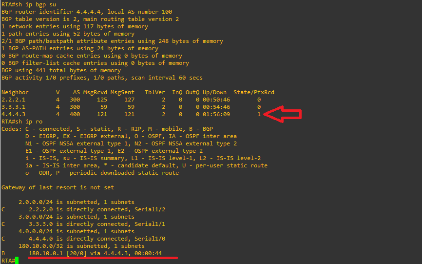
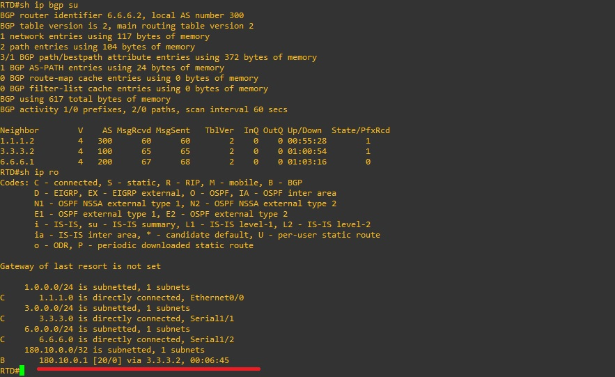
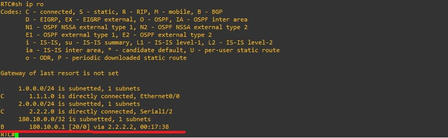
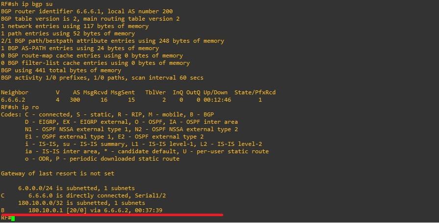
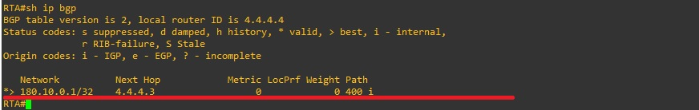

# Case Study 10: MED (Multi-Exit Discriminator)

## The Metric Attribute (MED)

The metric attribute is also known as MULTI_EXIT_DISCRIMINATOR, MED (BGP4), or INTER_AS (BGP3). This attribute acts as a suggestion to external neighbors regarding route preference within an Autonomous System (AS). It provides a dynamic way to influence another AS, such as determining how to reach a specific route when there are multiple entry points into that AS. A lower metric value is preferred.

Unlike local preference, the metric (MED) is exchanged between ASes. A metric is carried into an AS, but it does not leave it. When an update enters an AS with a specific metric, that metric is used to make routing decisions within the AS. When the update from that same AS is passed to a third AS, the metric is reset to 0. The diagram in this section illustrates the set of metrics. The default metric value is 0.

Unless a router receives other instructions, it compares metrics for routes from neighbors in the same AS. For the router to compare metrics from neighbors originating in different ASes, you must execute the special configuration command `bgp always-compare-med` on the router.


**Router A (RTA - AS 100):**
 
 ```text
!
!
interface Serial1/0
 ip address 4.4.4.4 255.255.255.0
 serial restart-delay 0
!
interface Serial1/1
 ip address 3.3.3.2 255.255.255.0
 serial restart-delay 0
!
interface Serial1/2
 ip address 2.2.2.2 255.255.255.0
 serial restart-delay 0
!
 ```

**Router C (RTC - AS 300):**

 ```text
!
interface Ethernet0/0
 ip address 1.1.1.2 255.255.255.0
 half-duplex
!
interface Serial1/2
 ip address 2.2.2.1 255.255.255.0
 serial restart-delay 0
!
interface Serial1/2
 ip address 2.2.2.2 255.255.255.0
 serial restart-delay 0
!
 ```

**Router B (RTC - AS 400):**

 ```text
!
interface Serial1/0
 ip address 4.4.4.3 255.255.255.0
 serial restart-delay 0
!
 ```

**Router D (RTD - AS 300):**

 ```text
!
interface Ethernet0/0
 ip address 1.1.1.1 255.255.255.0
 half-duplex
!
interface Serial1/1
 ip address 3.3.3.1 255.255.255.0
 serial restart-delay 0
!
interface Serial1/2
 ip address 6.6.6.2 255.255.255.0
 serial restart-delay 0
!
 ```

## Publish the Lo Interface on RTB

To publish the Loopback (`Lo`) interface on Router B (RTB), use the `network` command inside the BGP configuration mode:

**Router B (RTC - AS 400):**

 ```text
!
router bgp 400
network 180.10.0.1 mask 255.255.255.255
!
 ```

View the routing tables of Router A, Router D, and Router C.

**Router A (RTA - AS 100) routing table:**



**Router D (RTD - AS 300) routing table:**



**Router C (RTC - AS 300) routing table:**



**Router F (RTF - AS 200) routing table:**



**View the BGP forwarding table on Router A:**

sh ip bgp (BGP Table / Loc-RIB)

What it is: The internal and exclusive database of the BGP protocol.

**Router A (RTA - AS 100) routing table:**



What it shows: It stores all routes learned from BGP neighbors (both eBGP and iBGP), including multiple paths or alternative routes to the same destination (even those that were not selected as the best paths).

Attributes: It displays detailed information on BGP attributes for each route (such as AS-Path, Local Preference, MED, Next-Hop, and the > symbol to indicate which route is the "best path").


# CONFIGURING (Multi-Exit Discriminator):

**Router C MED Configuration (RTC - AS 300):**

 ```text
!
router bgp 300 
   neighbor 2.2.2.2 route-map ste out 
   route-map ste permit 10 
   set metric 200
!
 ```

**Router D MED Configuration (RTD - AS 300):**

 ```text
!
router bgp 300 
      neighbor 3.3.3.2 route-map ste out 
   route-map ste permit 10 
   set metric 150
!
 ```

**Router B MED Configuration (RTB - AS 400):**

 ```text
!
router bgp 400 
   neighbor 4.4.4.4 route-map ste out 
route-map ste permit 10 
   set metric 500
!
 ```

# Configuración de Métricas (MED) en BGP

El sentido de configurar estos comandos en los routers (**RTC**, **RTD** y **RTB**) es asignar y enviar valores de métrica (**MED** - *Multi-Exit Discriminator*) hacia los vecinos externos de BGP con el propósito de influir de manera dinámica en la selección de rutas.

## Desglose de cada bloque de configuración

* **Aplicación de un route-map:** Se utiliza la instrucción `neighbor [IP] route-map ste out` para aplicar un mapa de ruta llamado `ste` a las actualizaciones de BGP que salen hacia un vecino específico.
* **Definición de la política (`route-map ste permit 10`):** Permite que las rutas pasen a través del filtro y modifica sus atributos.
* **Modificación de la métrica (`set metric [valor]`):** Establece un valor de MED específico para las rutas anunciadas a ese vecino externo:
  * **Router C (RTC):** Asigna una métrica de `200` al vecino `2.2.2.2`.
  * **Router D (RTD):** Asigna una métrica de `150` al vecino `3.3.3.2`.
  * **Router B (RTB):** Asigna una métrica de `500` al vecino `4.4.4.4`.

## ¿Para qué sirve esto en la red?

Como el atributo **MED** funciona como una sugerencia para que un Sistema Autónomo (AS) externo decida cuál es el mejor punto de entrada o qué camino preferir (recordando que **un valor de métrica menor es preferido**), estos comandos permiten que los routers anuncien sus rutas con diferentes "costos".

De esta forma, el AS receptor sabrá a qué router darle prioridad (por ejemplo, preferirá la ruta de RTD con métrica `150`).

