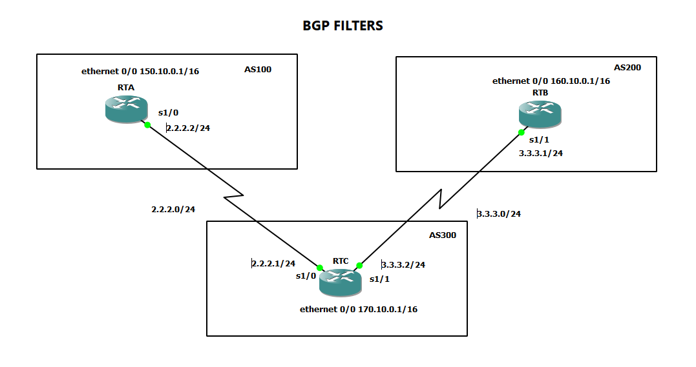
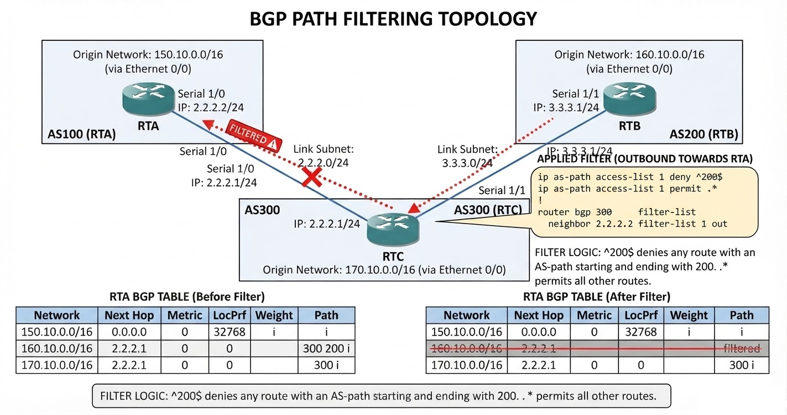

# Case 10: BGP Path Filtering

## 📋 Introduction
A series of different filtering methods allow you to control the sending and receiving of BGP updates. You can filter BGP updates using routing information, path information, or communities as a basis. All methods achieve the same results, and choosing one method over another depends on the specific network configuration. 

In this lab, we will perform filtering using path information (*AS-path*). The goal is to restrict the routing information that the router learns or announces from a particular neighbor by using access lists associated with route filters.



### Case Scenario
- **RTB** originates the network `160.10.0.0` (originating from **AS 200**) and sends the update to **RTC**.
- If **RTC** wants to stop the propagation of updates for the network `160.10.0.0` to **AS 100** (RTA), it must define an AS-path access list and apply it during communication with RTA.


---

## 🛠️ Step 1: Connectivity and Initial Configuration

1. **Link Configuration:** Configure all physical and logical connections between the links of the routers.

#### Router A (RTA - AS 100)

```router
!
interface Ethernet0/0
 ip address 150.10.0.1 255.255.0.0
 half-duplex
!
interface Serial1/0
 ip address 2.2.2.2 255.255.255.0
 serial restart-delay 0
!
```

#### Router C (RTC - AS 300)

```router
!
interface Ethernet0/0
 ip address 170.10.0.1 255.255.0.0
 half-duplex
!
interface Serial1/0
 ip address 2.2.2.1 255.255.255.0
 serial restart-delay 0
!
interface Serial1/1
 ip address 3.3.3.2 255.255.255.0
 serial restart-delay 0
!
```

#### Router B (RTB - AS 200)

```router
!
interface Ethernet0/0
 ip address 160.10.0.1 255.255.0.0
 half-duplex
!
interface Serial1/1
 ip address 3.3.3.1 255.255.255.0
 serial restart-delay 0
!
```


3. **Verification:** Verify that the interfaces between devices have connectivity through successful pings.

### BGP Configuration on Routers

#### Router A (RTA - AS 100)

```router
router bgp 100
 no synchronization
 bgp log-neighbor-changes
 neighbor 2.2.2.1 remote-as 300
 no auto-summary
```

#### Router C (RTC - AS 300)

```router
router bgp 300
 no synchronization
 bgp log-neighbor-changes
 neighbor 2.2.2.2 remote-as 100
 neighbor 3.3.3.1 remote-as 200
 no auto-summary
```

#### Router B (RTB - AS 200)

```router
router bgp 200
 no synchronization
 bgp log-neighbor-changes
 neighbor 3.3.3.2 remote-as 300
 no auto-summary
```

3. **Neighbor Verification:** Run the `show ip bgp summary` command on each router.
---

## 🌐 Step 2: Route Announcement

### 1. Configure and Verify the Network in RTA (AS 100)

```router
router bgp 100
 network 150.10.0.0 mask 255.255.0.0
```
* **Action:** Review and document the resulting routing tables (`show ip route` or `show ip bgp`) on RTA, RTB, and RTC.

### 2. Configure and Verify the Network in RTC (AS 300)

```router
router bgp 300
 network 170.10.0.0 mask 255.255.0.0
```
* **Action:** Review and document the updated routing tables on RTA, RTB, and RTC[cite: 1].

### 3. Configure and Verify the Network in RTB (AS 200)

```router
router bgp 200
 network 160.10.0.0 mask 255.255.0.0
```
* **Action:** Verify route propagation on each of the routers[cite: 1].

---

## 🛡️ Step 3: Applying Filters (AS-Path Access Lists)

To block updates for the network `160.10.0.0` from reaching AS 100, we will configure a route-based access list on **Router C (RTC)**[cite: 1].

### 1. Configuration on Router C (RTC)

Implement the access lists and apply them on the outbound direction toward neighbor RTA (`2.2.2.2`)[cite: 1]:

```router
ip as-path access-list 1 deny ^200$
ip as-path access-list 1 permit .*

router bgp 300 
 network 170.10.0.0 mask 255.255.0.0
 neighbor 3.3.3.1 remote-as 200 
 neighbor 2.2.2.2 remote-as 100 
 neighbor 2.2.2.2 filter-list 1 out
```

### 💡 Regular Expression Analysis
- **`^200$`**: The symbol `^` means "begins with" and `$` means "ends with". Since RTB sends updates for network `160.10.0.0` with path information originating in AS 200, it matches this rule and the access list **denies** those updates[cite: 1].
- **`.*`**: The dot `.` means "any character" and the asterisk `*` represents "the repetition of that character". Therefore, `.*` represents any other path information, which is necessary to **permit** the transmission of all other routing updates[cite: 1].

---

## 📝 Analysis Questions and Conclusions

1. **What effect does denying via `^200$` and permitting via `.*` have, according to the previous statements?**  
   *(Document your answer here on how the origin of AS 200 is selectively blocked while the rest of the traffic is permitted).*[cite: 1]

2. **Check the routing table on Router A (RTA). Why does network `160.10.0.0` no longer appear via BGP?**  
   *(Explain how the filter applied on RTC prevents the route from being advertised to RTA).*[cite: 1]

3. **What is the purpose of the `filter-list` command?**  
   *(Describe the function of associating an AS-path access list with a specific BGP neighbor).*[cite: 1]

4. **Explain the diagram or behavior observed in the network.**  
   *(Write a technical conclusion regarding BGP route filtering based on path vectors).*[cite: 1]
