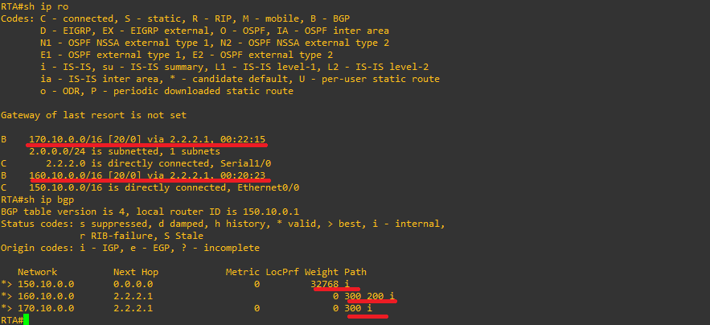
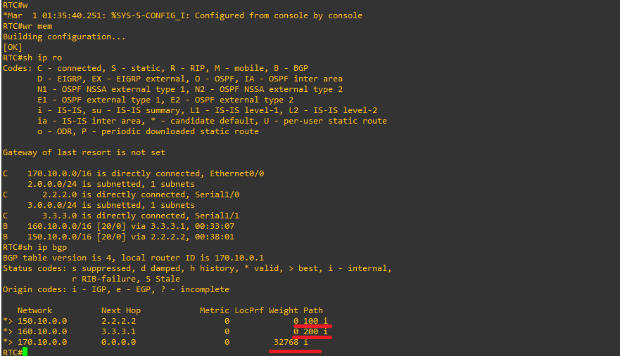
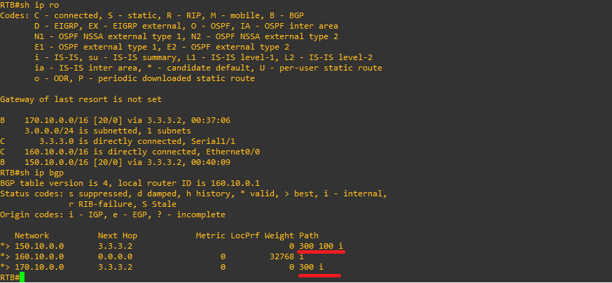
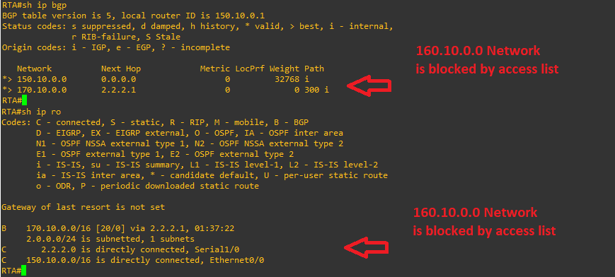

# Case 10: BGP Path Filtering

## 📋 Introduction
A series of different filtering methods allow you to control the sending and receiving of BGP updates. You can filter BGP updates using routing information, path information, or communities as a basis. All methods achieve the same results, and choosing one method over another depends on the specific network configuration. 

In this lab, we will perform filtering using path information (*AS-path*). The goal is to restrict the routing information that the router learns or announces from a particular neighbor by using access lists associated with route filters.


### Case Scenario
- **RTB** originates the network `160.10.0.0` (originating from **AS 200**) and sends the update to **RTC**.
- If **RTC** wants to stop the propagation of updates for the network `160.10.0.0` to **AS 100** (RTA), it must define an AS-path access list and apply it during communication with RTA.


---

## 🛠️ Step 1: Connectivity and Initial Configuration

1. **Link Configuration:** Configure all physical and logical connections between the links of the routers.

#### Router A (RTA - AS 100)

```router
!
interface Ethernet0/0
 ip address 150.10.0.1 255.255.0.0
 half-duplex
!
interface Serial1/0
 ip address 2.2.2.2 255.255.255.0
 serial restart-delay 0
!
```

#### Router C (RTC - AS 300)

```router
!
interface Ethernet0/0
 ip address 170.10.0.1 255.255.0.0
 half-duplex
!
interface Serial1/0
 ip address 2.2.2.1 255.255.255.0
 serial restart-delay 0
!
interface Serial1/1
 ip address 3.3.3.2 255.255.255.0
 serial restart-delay 0
!
```

#### Router B (RTB - AS 200)

```router
!
interface Ethernet0/0
 ip address 160.10.0.1 255.255.0.0
 half-duplex
!
interface Serial1/1
 ip address 3.3.3.1 255.255.255.0
 serial restart-delay 0
!
```


3. **Verification:** Verify that the interfaces between devices have connectivity through successful pings.

### BGP Configuration on Routers

#### Router A (RTA - AS 100)

```router
router bgp 100
 no synchronization
 bgp log-neighbor-changes
 neighbor 2.2.2.1 remote-as 300
 no auto-summary
```

#### Router C (RTC - AS 300)

```router
router bgp 300
 no synchronization
 bgp log-neighbor-changes
 neighbor 2.2.2.2 remote-as 100
 neighbor 3.3.3.1 remote-as 200
 no auto-summary
```

#### Router B (RTB - AS 200)

```router
router bgp 200
 no synchronization
 bgp log-neighbor-changes
 neighbor 3.3.3.2 remote-as 300
 no auto-summary
```

3. **Neighbor Verification:** Run the `show ip bgp summary` command on each router.
---

## 🌐 Step 2: Route Announcement

### 1. Configure the Network advertisement for (150.10.0.0) in RTA (AS 100)

```router
router bgp 100
 network 150.10.0.0 mask 255.255.0.0
```
### 2. Configure the Network advertisement for (170.10.0.0) in RTC (AS 300)

```router
router bgp 300
 network 170.10.0.0 mask 255.255.0.0
```

### 3. Configure the Network advertisement for RTB (AS 200)

```router
router bgp 200
 network 160.10.0.0 mask 255.255.0.0
```
### **Action:** Verify route propagation on each of the routers RTA, RTB. RTC**

RTA (AS 100):



### Breakdown of Routes in the BGP Table from RTA:

Each line represents a network learned or advertised via BGP, along with its respective attributes:

* **First Network (150.10.0.0):**
  * **Status (`*>`):** It is a valid route and the best route.
  * **Next Hop (`0.0.0.0`):** Means this network is locally originated on this same router (RTA).
  * **Metric / LocPrf / Weight (`0` / `32768`):** Being a local network, it has a metric of 0 and a default high Weight of 32768.
  * **Path (`i`):** Its origin is IGP.

* **Second Network (160.10.0.0):**
  * **Status (`*>`):** It is a valid route and the best route.
  * **Next Hop (`2.2.2.1`):** The next hop to reach this network is the IP address of the BGP neighbor (RTC).
  * **Path (`300 200 i`):** Shows the autonomous system vector (AS-path). Indicates that the update passed first through AS 300 (RTC) and originally originated in AS 200 (RTB).

* **Third Network (170.10.0.0):**
  * **Status (`*>`):** It is a valid route and the best route.
  * **Next Hop (`2.2.2.1`):** Traffic is directed towards the RTC neighbor (`2.2.2.1`).
  * **Metric / Path (`300 i`):** Indicates that this network belongs directly to AS 300 (RTC) with an IGP type origin.

RTC (AS 300):



### Breakdown of Routes in the BGP Table from RTC:

Each line shows the information of the networks learned and managed by RTC:

* **First Network (150.10.0.0):**
  * **Status (`*>`):** Valid route and selected as the best route.
  * **Next Hop (`2.2.2.2`):** The next hop to reach this network is the IP address of the corresponding BGP neighbor (RTA).
  * **Metric / Path (`0` / `100 i`):** It has a metric of 0, and its path shows that it belongs to AS 100 (RTA) with an IGP-type origin.

* **Second Network (160.10.0.0):**
  * **Status (`*>`):** Valid route and selected as the best route.
  * **Next Hop (`3.3.3.1`):** Traffic is directed towards the BGP neighbor RTB (`3.3.3.1`).
  * **Path (`200 i`):** Indicates that the route originates directly in AS 200 (RTB) with an IGP-type origin.

* **Third Network (170.10.0.0):**
  * **Status (`*>`):** Valid route and selected as the best route.
  * **Next Hop (`0.0.0.0`):** Since it is locally configured on this router (RTC), the next hop is zero.
  * **Metric / Weight (`0` / `32768`):** Being a locally originated network, it has a default high Weight of 32768.

RTB (AS 200):



### Breakdown of Routes in the BGP Table from RTB:

Each line shows the information of the networks learned and managed by RTC:

* **First Network (150.10.0.0):**
  * **Status (`*>`):** Valid route and selected as the best route.
  * **Next Hop (`2.2.2.2`):** The next hop to reach this network is the IP address of the corresponding BGP neighbor (RTA).
  * **Metric / Path (`0` / `100 i`):** It has a metric of 0, and its path shows that it belongs to AS 100 (RTA) with an IGP-type origin.

* **Second Network (160.10.0.0):**
  * **Status (`*>`):** Valid route and selected as the best route.
  * **Next Hop (`3.3.3.1`):** Traffic is directed towards the BGP neighbor RTB (`3.3.3.1`).
  * **Path (`200 i`):** Indicates that the route originates directly in AS 200 (RTB) with an IGP-type origin.

* **Third Network (170.10.0.0):**
  * **Status (`*>`):** Valid route and selected as the best route.
  * **Next Hop (`0.0.0.0`):** Since it is locally configured on this router (RTC), the next hop is zero.
  * **Metric / Weight (`0` / `32768`):** Being a locally originated network, it has a default high Weight of 32768.

---

## 🛡️ Step 3: Applying Filters (AS-Path Access Lists)

To block updates for the network `160.10.0.0` from reaching AS 100, we will configure a route-based access list on **Router C (RTC)**[cite: 1].

### 1. Configuration on Router C (RTC)

Implement the access lists and apply them on the outbound direction toward neighbor RTA (`2.2.2.2`):

```router
ip as-path access-list 1 deny ^200$
ip as-path access-list 1 permit .*
```

Implement the access lists and apply them on the outbound direction toward neighbor RTA (`2.2.2.2`):

```
router bgp 300 
 network 170.10.0.0 mask 255.255.0.0
 neighbor 3.3.3.1 remote-as 200 
 neighbor 2.2.2.2 remote-as 100 
 neighbor 2.2.2.2 filter-list 1 out
```


### Breakdown of Routes in the BGP Table on RTA (Post-Filtering)

After applying the `filter-list 1 out` command on Router C (RTC) toward neighbor RTA (`2.2.2.2`), let's analyze the updated output of the `show ip bgp` and `show ip route` commands on RTA:

* **First Network (`150.10.0.0`):**
  * **Status (`*>`):** Valid route and selected as the best route.
  * **Next Hop (`0.0.0.0`):** Locally originated network on RTA itself.
  * **Metric / Weight (`0` / `32768`):** Local network attributes.

* **Second Network (`170.10.0.0`):**
  * **Status (`*>`):** Valid route and selected as the best route.
  * **Next Hop (`2.2.2.1`):** Traffic points toward the neighbor RTC (`2.2.2.1`).
  * **Path (`300 i`):** Indicates it belongs to AS 300 (RTC) with an IGP-type origin.

---

### Key Observation: What happened to network `160.10.0.0`?

* **Disappearance from BGP & Routing Tables:** The network `160.10.0.0` (originating from AS 200) **no longer appears** in RTA's BGP table or routing table (`show ip ro`).
* **Reason:** The AS-path access list `ip as-path access-list 1 deny ^200$` configured on RTC matched the update path starting and ending with AS 200 (`200`), blocking it from being advertised outbound to RTA (`2.2.2.2`), while `ip as-path access-list 1 permit .*` allowed all other traffic to pass successfully.

### 💡 Regular Expression Analysis
- **`^200$`**: The symbol `^` means "begins with" and `$` means "ends with". Since RTB sends updates for network `160.10.0.0` with path information originating in AS 200, it matches this rule and the access list **denies** those updates[cite: 1].
- **`.*`**: The dot `.` means "any character" and the asterisk `*` represents "the repetition of that character". Therefore, `.*` represents any other path information, which is necessary to **permit** the transmission of all other routing updates[cite: 1].

---

## 📝 Analysis Questions and Conclusions

### 1) How does the filter applied on RTC prevent the route from being advertised to RTA?

The filter applied on RTC uses an AS-path access list (`ip as-path access-list 1 deny ^200$`) that specifically identifies and blocks updates whose autonomous system path begins and ends with AS 200 (the origin of the network 160.10.0.0). By applying this filter in the outbound direction toward the RTA neighbor (`neighbor 2.2.2.2 filter-list 1 out`), RTC discards this update and avoids advertising it, meaning RTA never receives it or installs it in its routing table.

### 2) What is the purpose of the `filter-list` command?

The function of associating an AS-path access list via the `filter-list` command with a specific BGP neighbor is to granularly control which routes are accepted or advertised based on the autonomous system vector through which the routing information has traveled. This allows for customized per-neighbor filtering policies (either inbound or outbound).

### 3) Explanation of the diagram and technical conclusion regarding BGP route filtering based on path vectors:

As a technical conclusion, path vector filtering (AS-path filtering) in BGP proves to be an extremely powerful and flexible mechanism for controlling routing policies between different Autonomous Systems. By using regular expressions (such as `^200$`), routers can inspect the complete history of an update's path and make selective denial or permission decisions (complemented by wildcards like `.*`), preventing routing loops or controlling the propagation of unwanted prefixes to neighboring domains without affecting the remaining legitimate traffic.

4. **Explain the diagram or behavior observed in the network.**  
   *(Write a technical conclusion regarding BGP route filtering based on path vectors).*[cite: 1]
