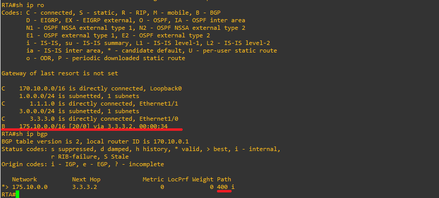
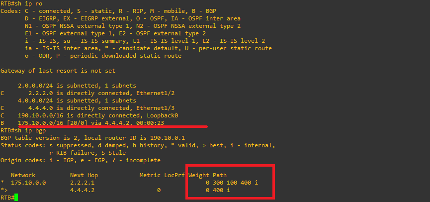
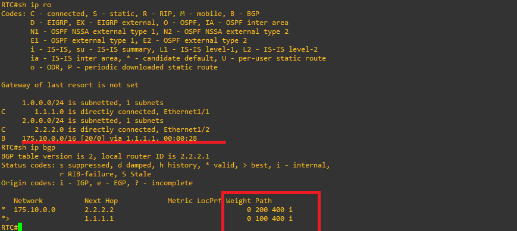

# TECHNICAL LOG & BGP ENGINEERING GUIDE

## Traffic Manipulation via the Weight Attribute
**CCNP Miguelangel Luna**

---

## 1. Introduction and Theoretical Framework

The Weight attribute is a Cisco proprietary parameter used in BGP (Border Gateway Protocol) for best path selection. Its main characteristics are:

* **Local Scope:** It has meaning exclusively within the local router where it is configured and is not propagated via BGP routing updates to neighbors.
* **Value Range:** An integer number between 0 and 65,535.
* **Default Values:** Routes originated locally by the router receive a weight of 32,768 by default; routes learned from external or internal neighbors receive a weight of 0 by default.
* **Precedence:** It is evaluated in the absolute first place within BGP's decision algorithm (above Local Preference, AS_PATH, MED, etc.). Routes with a higher Weight value have absolute preference.

## 2. Topology and BGP Neighbor Establishment

The topology consists of four routers across different Autonomous Systems (AS 100, AS 200, AS 300, and AS 400). Before advertising prefixes, BGP neighbor adjacencies were established on each device.


 four routers across different Autonomous Systems (AS 100, AS 200, AS 300, and AS 400). Before advertising prefixes, BGP neighbor adjacencies were established on each device.

## 3. BGP Configuration:

**Router A (RTA - AS 100):**

```text
! 
router bgp 100
 no synchronization
 bgp log-neighbor-changes
 neighbor 1.1.1.2 remote-as 300
 neighbor 3.3.3.2 remote-as 400
 no auto-summary
!
```

**Router B (RTB - AS 200):**

```text
! 
router bgp 200
 no synchronization
 bgp log-neighbor-changes
 neighbor 2.2.2.1 remote-as 300
 neighbor 4.4.4.2 remote-as 400
 no auto-summary
!
```

**Router C (RTC - AS 300):**

```text
! 
router bgp 300
 no synchronization
 bgp log-neighbor-changes
 neighbor 1.1.1.1 remote-as 100
 neighbor 2.2.2.2 remote-as 200
 no auto-summary
!
```

**Router D (RTD - AS 400):**

```text
! 
router bgp 400
 no synchronization
 bgp log-neighbor-changes
 neighbor 3.3.3.1 remote-as 100
 neighbor 4.4.4.1 remote-as 200
 no auto-summary
 network 175.10.0.0
!
```
## 3. ADD ROUTE:

**Router D (RTD - AS 400):**

```text
! 
router bgp 400
 network 175.10.0.0
!
```

## 4. Log and Initial Validations with Evidences

Following the advertisement of the 175.10.0.0/16 network on Router D (AS 400), routing and forwarding tables were verified across each node in the topology. Below are the corresponding graphic evidences.

3.1 Validation on Router A (RTA)



RTA shows the IP and BGP routing table on RTA, verifying the learning of the 175.10.0.0/16 network via next-hop 3.3.3.2 with default Weight 0.

3.2 Validation on Router B (RTB)



RTB Shows the successful propagation of the route toward the 175.10.0.0/16 network on Router B.

3.4 Validation on Router C (RTC)



