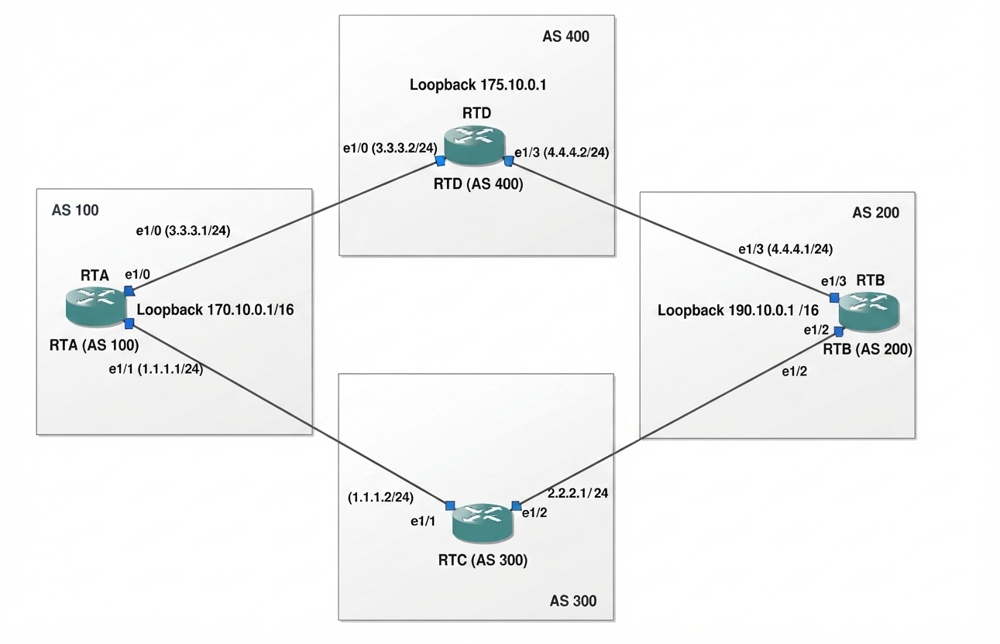

# TECHNICAL LOG & BGP ENGINEERING GUIDE

## Traffic Manipulation via the Weight Attribute
**CCNP Miguelangel Luna**

---

## 1. Introduction and Theoretical Framework

The Weight attribute is a Cisco proprietary parameter used in BGP (Border Gateway Protocol) for best path selection. Its main characteristics are:

* **Local Scope:** It has meaning exclusively within the local router where it is configured and is not propagated via BGP routing updates to neighbors.
* **Value Range:** An integer number between 0 and 65,535.
* **Default Values:** Routes originated locally by the router receive a weight of 32,768 by default; routes learned from external or internal neighbors receive a weight of 0 by default.
* **Precedence:** It is evaluated in the absolute first place within BGP's decision algorithm (above Local Preference, AS_PATH, MED, etc.). Routes with a higher Weight value have absolute preference.

## 2. Topology and BGP Neighbor Establishment

The topology consists of four routers across different Autonomous Systems (AS 100, AS 200, AS 300, and AS 400). Before advertising prefixes, BGP neighbor adjacencies were established on each device.

                          
