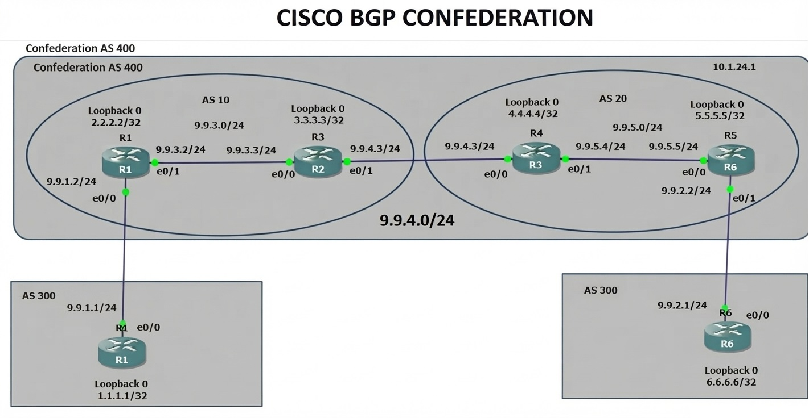

# TECHNICAL LOG & BGP CONFEDERATION

## Traffic Manipulation via the Weight Attribute
**CCNP Miguelangel Luna**

---

## CONTENIDOS:

| Case | Title | Description |
| :--- | :--- | :--- |
| **01** | [Claude & n8n AI Agents](./case-01-Google-Auth/) | Agentes Claude . |
| **02** | [Packet Tracert & VS CODE](./case-02-PT-MCP-VS-Code/) | Conecta Packet Tracert con MCP |
| **03** | [Generar un Archivo Word desde Markdown usando Phyton](./case-03-Markdown-Word-Using-Phyton/) | Convierte un MD a Word usando Phyton |
| **04** | [GNS3 AI](./case04-GNS3-AI/) | Conexion GNS3 MCP. |

[Google](https://www.google.com)

## 1. Introduction and Theoretical Framework

**BGP Confederation (defined in RFC 5065):** is a scalability technique that allows a large Autonomous System (AS) to be divided into multiple smaller internal sub-ASes. To external ASes, the entire setup still appears as a single Autonomous System, but internally, it avoids the scalability issues of traditional iBGP design.

## 2. Topology and BGP Neighbor Establishment

Topologia


 four routers across different Autonomous Systems (AS 100, AS 200, AS 300, and AS 400). Before advertising prefixes, BGP neighbor adjacencies were established on each device.

## 3. BGP Routing Configuration:

**R1 (AS 300):**

```text
!
interface Loopback0
 ip address 1.1.1.1 255.255.255.255
!
interface Ethernet0/0
 description Link to R2
 ip address 9.9.1.1 255.255.255.0
!
```

**R2 (Sub-AS 10 - Confederation 400):**

```text
!
interface Loopback0
 ip address 2.2.2.2 255.255.255.255
!
interface Ethernet0/0
 description Link to R1
 ip address 9.9.1.2 255.255.255.0
 !
interface Ethernet0/1
 description Link to R4
 ip address 9.9.3.2 255.255.255.0
 !
router ospf 1
 router-id 2.2.2.2
 network 2.2.2.2 0.0.0.0 area 0
 network 9.9.3.0 0.0.0.255 area 0
!
```

**R3 (Sub-AS 10 - Confederación 400):**

```text
!
interface Loopback0
 ip address 3.3.3.3 255.255.255.255
!
interface Ethernet0/0
 ip address 9.9.3.3 255.255.255.0
!
interface Ethernet0/1
 ip address 9.9.4.3 255.255.255.0
 !
router ospf 1
 router-id 3.3.3.3
 network 3.3.3.3 0.0.0.0 area 0
 network 9.9.3.0 0.0.0.255 area 0
 network 9.9.4.0 0.0.0.255 area 0
!
```

**R4 (Core 400, Sub-AS 20):**

```text
!
interface Loopback0
 ip address 4.4.4.4 255.255.255.255
!
interface Ethernet0/0
 ip address 9.9.4.4 255.255.255.0
!
interface Ethernet0/1
 ip address 9.9.5.4 255.255.255.0
!
router ospf 1
 router-id 4.4.4.4
 network 4.4.4.4 0.0.0.0 area 0
 network 9.9.4.0 0.0.0.255 area 0
 network 9.9.5.0 0.0.0.255 area 0
!
```

**R5 (Core 400, Sub-AS 20):**

```text
!
interface Loopback0
 ip address 5.5.5.5 255.255.255.255
!
interface Ethernet0/0
 ip address 9.9.5.5 255.255.255.0
!
interface Ethernet0/1
 ip address 9.9.2.2 255.255.255.0
!
router ospf 1
router-id 5.5.5.5
network 5.5.5.5 0.0.0.0 area 0
network 9.9.5.0 0.0.0.255 area 0
!
```

**R6 (AS 300):**

```text
!
interface Loopback0
 ip address 6.6.6.6 255.255.255.255
!
interface Ethernet0/0
 ip address 9.9.2.1 255.255.255.0
 half-duplex
!
```

### 4. BGP Configuration:

**R1 (AS 300):**

```text
!
router bgp 300
 bgp log-neighbor-changes
 network 1.1.1.1 mask 255.255.255.255
 neighbor 9.9.1.2 remote-as 400
!
```

**R2 (Sub-AS 10 - Confederation 400):**

```text
!
router bgp 10
 bgp log-neighbor-changes
 bgp confederation identifier 400
 bgp confederation peers 20
 neighbor 3.3.3.3 remote-as 10
 neighbor 3.3.3.3 update-source Loopback0
 neighbor 9.9.1.1 remote-as 300
!
```

**R3 (Sub-AS 10 - Confederación 400):**

```text
!
router bgp 10
 bgp log-neighbor-changes
 bgp confederation identifier 400
 bgp confederation peers 20
 neighbor 2.2.2.2 remote-as 10
 neighbor 2.2.2.2 update-source Loopback0
 neighbor 4.4.4.4 remote-as 20
 neighbor 4.4.4.4 ebgp-multihop 2
 neighbor 4.4.4.4 update-source Loopback0
!
```


**R4 (Sub-AS 20 - Confederación 400):**

```text
!
router bgp 20
 bgp log-neighbor-changes
 bgp confederation identifier 400
 bgp confederation peers 10
 neighbor 3.3.3.3 remote-as 10
 neighbor 3.3.3.3 ebgp-multihop 2
 neighbor 3.3.3.3 update-source Loopback0
 neighbor 5.5.5.5 remote-as 20
 neighbor 5.5.5.5 update-source Loopback0
!
```

**R5 (Sub-AS 20 - Confederación 400):**

```text
!
router bgp 20
 no synchronization
 bgp log-neighbor-changes
 bgp confederation identifier 400
 bgp confederation peers 10
 neighbor 4.4.4.4 remote-as 20
 neighbor 4.4.4.4 update-source Loopback0
 neighbor 4.4.4.4 next-hop-self
 neighbor 9.9.2.1 remote-as 300
 no auto-summary
!
```
